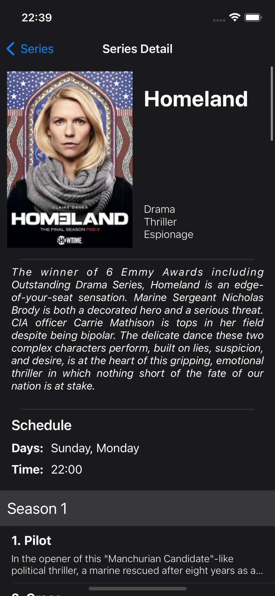

# TVSeries Guide

This is a simple iOS app proposed in a coding challenge that shows some TV Shows information from the [TVMaze API](https://www.tvmaze.com/api). It was built using Swift with MVVM Architecture and Xcode 13.2.

## How to use
Clone this repository and open the project using Xcode.

## Features
- Show all Series
- Search Series by name
- Show the Series' informations
- Show episodess details
- Protect the app using a Password or Biometry (TouchID and FaceID, if available)
- Unit testing

## Screenshots

